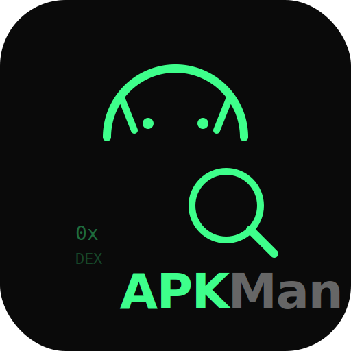

<div align="center">



# APKMan

**Reverse engineer Android APKs directly in your browser.**\
No uploads. No servers. No installs. Everything runs client-side.

[Live Demo →](https://apkman.wencai.app)

[](https://nextjs.org)
[](https://www.typescriptlang.org)
[](https://www.rust-lang.org)
[](LICENSE)
[](#-pwa--offline)

---

*Drop an APK → explore manifest, decompile DEX, browse resources, verify signatures — all in one tab.*

</div>

## Features

<table>
<tr>
<td width="50%">

### 🔍 Manifest Parser
Decode binary `AndroidManifest.xml` to readable XML. Permissions, activities, services, receivers, providers, intent filters — everything at a glance.

</td>
<td width="50%">

### ☕ DEX → Java Decompiler
Full DEX-to-Java decompilation via **Rust → WebAssembly**. Structured control flow, SSA IR, type inference, expression simplification. Smali view included.

</td>
</tr>
<tr>
<td>

### 📦 Resource Browser
Parse `resources.arsc`, browse string tables, view images inline, decode binary XML from `res/`.

</td>
<td>

### 🔐 Signature Verification
Inspect signing certificates — issuer, subject, validity, fingerprints (MD5 / SHA-1 / SHA-256), scheme versions.

</td>
</tr>
<tr>
<td>

### 📂 File Tree + Code View
Full ZIP extraction with folder tree, file sizes, syntax highlighting via Monaco Editor.

</td>
<td>

### 💾 Instant Cache
IndexedDB-backed cache (SHA-256 keyed). Re-open previously analyzed APKs instantly.

</td>
</tr>
<tr>
<td>

### 🔎 Global Search
`Ctrl+K` to search across permissions, string resources, class names, and method names. Results grouped by category with click-to-navigate.

</td>
<td>

### 📊 APK Comparison
Load two APKs side-by-side. Diff permissions, classes, manifest entries, and file sizes at a glance.

</td>
</tr>
<tr>
<td>

### 📥 Export as ZIP
One-click export of decoded manifest, resource XMLs, string tables, and all Smali source files.

</td>
<td>

### ⚡ Web Worker Parsing
Heavy parsing runs off the main thread with real-time progress. UI stays buttery smooth on large APKs.

</td>
</tr>
<tr>
<td>

### 🧩 Multi-DEX Support
Seamless handling of `classes.dex`, `classes2.dex`, … — per-DEX filtering, merged class list, source labels.

</td>
<td>

### 📱 PWA & Offline
Install as a native app. Service worker caches everything including the WASM module — works fully offline.

</td>
</tr>
</table>

## Architecture

```
APK File (browser File API)
│
├─ Web Worker ─────────── Off-main-thread parsing pipeline
│   │
│   ├─ JSZip ──────────── ZIP extraction + file tree
│   ├─ AXML Parser ────── Binary XML → readable XML (pure JS)
│   ├─ DEX Parser ─────── DEX headers, strings, types, classes (pure JS)
│   ├─ Resource Parser ── resources.arsc → string/resource tables (pure JS)
│   └─ Signature Parser ─ PKCS#7 certificates + fingerprints (pure JS)
│
├─ DEX Decompiler ─────── Rust → WASM (331 KB)
│   └─ CFG → SSA IR → Region Tree → Java source
│
├─ IndexedDB Cache ────── SHA-256 keyed, instant reload
│
└─ Service Worker ─────── Offline-first caching strategy
```

> **Everything runs client-side.** Your APK files never leave your browser.

## Tech Stack

| Layer | Technology |
|:------|:-----------|
| **Framework** | Next.js 16 (App Router, Turbopack) |
| **UI** | React 19 · shadcn/ui · Tailwind CSS 4 |
| **Language** | TypeScript 5 |
| **Decompiler** | Rust → WASM ([androguard/dex-decompiler](https://github.com/androguard/dex-decompiler)) |
| **ZIP** | JSZip |
| **Code View** | Monaco Editor |
| **Storage** | IndexedDB |
| **Offline** | Service Worker + Web App Manifest |

## Getting Started

```bash
git clone https://github.com/jiusanzhou/apkman.git
cd apkman
npm install
npm run dev
```

Open [http://localhost:3000](http://localhost:3000) and drop an APK.

### Production Build

```bash
npm run build
npm start
```

### Building the WASM Decompiler

Pre-built binary included in `public/wasm/`. To rebuild from source:

```bash
cd vendor/dex-wasm
wasm-pack build --target web --release
cp pkg/dex_wasm_bg.wasm ../../public/wasm/
cp pkg/dex_wasm.js ../../public/wasm/
```

> Requires [Rust](https://rustup.rs) + [wasm-pack](https://rustwasm.github.io/wasm-pack/).

## Roadmap

- [x] Global search (permissions, classes, strings, methods)
- [x] Multi-DEX improved handling
- [x] APK comparison / diff
- [x] Export decompiled source as ZIP
- [x] Web Worker parsing for large APKs
- [x] PWA offline support
- [ ] Decompiled Java source (currently Smali only for export)
- [ ] Shareable analysis links (hash-based)
- [ ] Browser extension for one-click analysis

## License

[MIT](LICENSE)

<div align="center">

---

Built by [@jiusanzhou](https://github.com/jiusanzhou)

</div>
